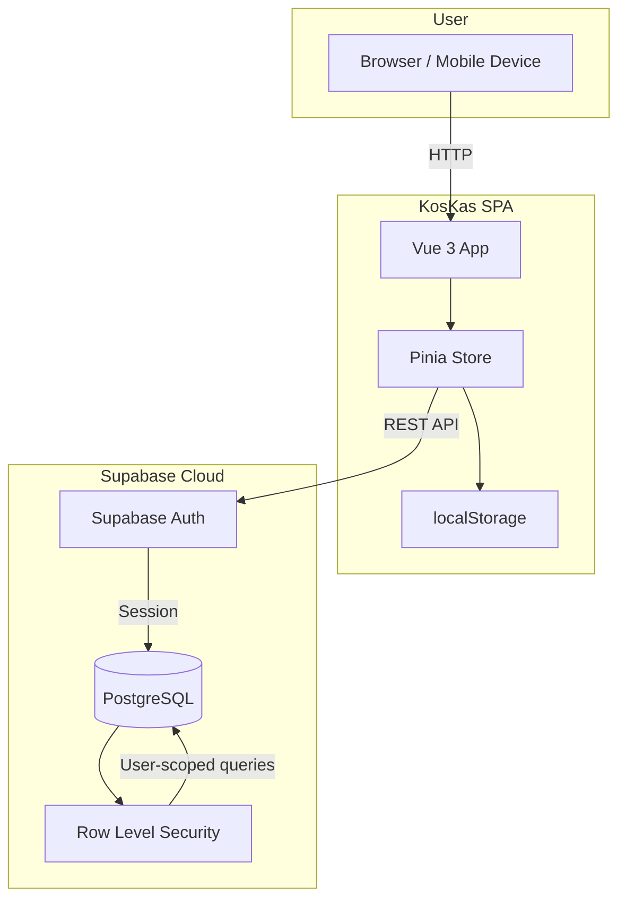
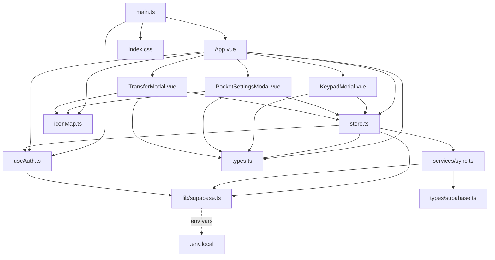
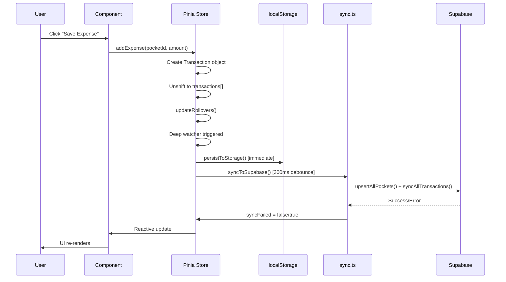
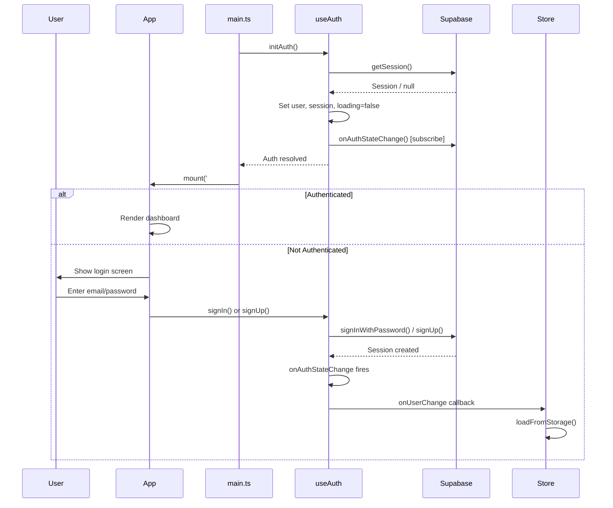
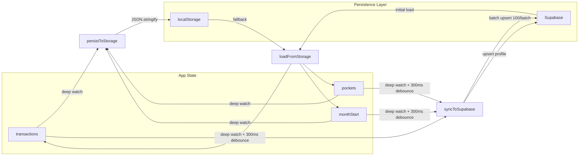
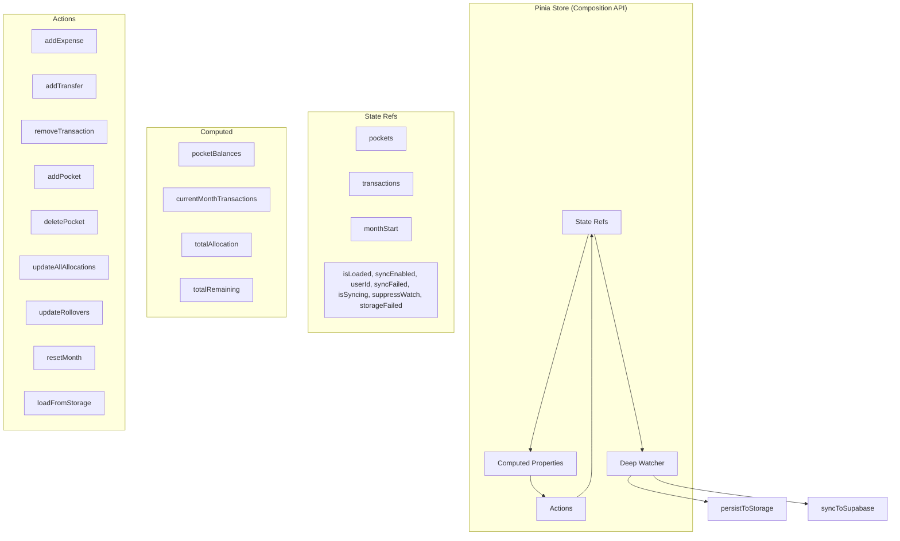

# Architecture Overview

System architecture, data flow, and design decisions for the KosKas application.

---

## Table of Contents

1. [System Context](#system-context)
2. [Module Dependency Graph](#module-dependency-graph)
3. [Data Flow](#data-flow)
4. [Authentication Flow](#authentication-flow)
5. [Sync Architecture](#sync-architecture)
6. [State Management](#state-management)
7. [Directory Structure](#directory-structure)
8. [Technology Stack](#technology-stack)
9. [Design Decisions](#design-decisions)

---

## System Context



---

## Module Dependency Graph



---

## Data Flow



---

## Authentication Flow



---

## Sync Architecture



**Key characteristics:**
- localStorage is the primary persistence (synchronous, immediate)
- Supabase sync is additive (async, debounced 300ms)
- On initial load: Supabase data takes priority; local data uploads if remote is empty
- `suppressWatch` flag prevents sync during rollover recalculation
- Online/offline detection triggers re-sync on connectivity restore

---

## State Management



---

## Directory Structure

```
koskas/
├── index.html                  # Entry HTML; CSP meta tag, font loading, #root mount
├── package.json                # Package metadata, scripts, dependencies
├── tsconfig.json               # TypeScript config (strict, ES2022, bundler mode)
├── env.d.ts                    # Type declarations for Vite & .vue modules
├── vite.config.ts              # Vite: Vue + Tailwind plugins, @/ alias, console strip
├── vitest.config.ts            # Vitest: happy-dom, @/ alias, setup file
├── AGENT.md                    # AI coding assistant configuration
├── ARCHITECTURE.md             # Detailed technical architecture (existing)
├── .env.example                # Environment variable template
├── metadata.json               # AI Studio metadata
├── docs/                       # Generated documentation
│   ├── api-reference.md        # Full API reference
│   ├── architecture.md         # This file
│   └── documentation-report.md # Documentation coverage report
├── plan/                       # Development plans and reviews
├── assets/                     # Static assets
├── dist/                       # Production build output
└── src/
    ├── main.ts                 # App entry: initAuth + createApp + mount
    ├── store.ts                # Pinia store: state, computed, actions, persistence
    ├── types.ts                # Interfaces, constants, type guards, utilities
    ├── index.css               # Tailwind v4 entry + @theme custom variables
    ├── App.vue                 # Root component: auth gate, views, modals
    ├── iconMap.ts              # Lucide icon name → Vue component mapping
    ├── test-setup.ts           # Vitest global setup: mocks for Supabase, localStorage
    ├── lib/
    │   └── supabase.ts         # Supabase client singleton
    ├── services/
    │   └── sync.ts             # Remote CRUD: fetch/upsert/delete with batch upsert
    ├── composables/
    │   └── useAuth.ts          # Auth composable: signUp, signIn, Google OAuth, signOut
    ├── types/
    │   └── supabase.ts         # Auto-generated Supabase schema types
    └── components/
        ├── KeypadModal.vue     # Expense entry: numeric keypad + pocket selector
        ├── PocketSettingsModal.vue # Budget allocation: CRUD pockets, allocations
        └── TransferModal.vue   # Inter-pocket transfer: balance validation
```

---

## Technology Stack

| Layer | Technology | Version | Purpose |
|-------|-----------|---------|---------|
| Framework | Vue 3 | 3.5 | Composition API, reactive UI |
| State | Pinia | 4.0 | Composition store pattern |
| Language | TypeScript | 5.8 | Type safety |
| Styling | Tailwind CSS | 4.1 | Utility-first, custom @theme |
| Build | Vite | 6.2 | Dev server + production build |
| Auth | Supabase Auth | 2.x | Email/password + Google OAuth |
| Database | Supabase (PostgreSQL) | 17 | Cloud sync with RLS |
| Testing | Vitest + happy-dom | 4.x | Unit tests with DOM simulation |
| Icons | Lucide | 1.0 | Tree-shakeable icon components |
| Package Manager | pnpm | 10.28 | Fast, disk-efficient installs |

---

## Design Decisions

| Decision | Rationale |
|----------|-----------|
| Vue 3 Composition API | Declarative reactivity, type-safe with `<script setup>` |
| Pinia composition pattern | Modern state management with superior TypeScript support |
| Supabase + localStorage | Cloud sync with offline fallback |
| No router | Single-view app with tab-based switching |
| Custom breakpoints | Mobile-first with finer granularity than Tailwind defaults |
| Keypad-based input | Optimized for mobile; faster than physical keyboard |
| System pockets | Data integrity; core pockets cannot be deleted |
| Auto rollover | Reduces manual work; leftover food budget is auto-tracked |
| Binary search insertion | O(log n) find + O(n) splice for sorted transaction insertion |
| Data validation on load | Runtime type guards prevent corrupted localStorage crashes |
| Batch upsert (100 rows) | Efficient Supabase writes within per-request limits |
| Content Security Policy | CSP meta tag restricts script/style/font/connect sources |
| Console stripping | `esbuild.drop: ['console', 'debugger']` in production |
| Debounced sync (300ms) | Prevents excessive Supabase API calls on rapid mutations |
| `suppressWatch` flag | Prevents sync during rollover recalculation |
